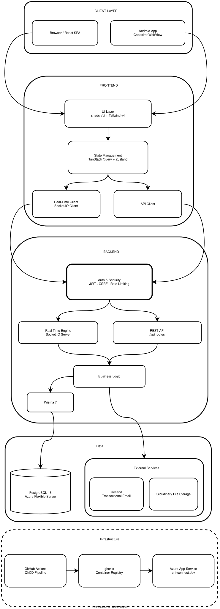

# UniConnect

[](https://uni-connect.dev)
[](https://nodejs.org)
[](https://react.dev)
[](https://www.typescriptlang.org)
[](https://www.postgresql.org)
[](https://expressjs.com)
[](https://www.prisma.io)
[](https://capacitorjs.com)

**UniConnect** is an enterprise-grade, Discord-inspired communication and academic lifecycle management platform engineered for **National Textile University (NTU), Faisalabad**.

By combining the familiar, community-first user experience of Discord (hierarchical servers, scoped channels, rich-text posts, and real-time WebSockets) with institutional academic structure, automated course-channel provisioning, and fine-grained role-based access control, UniConnect replaces fragmented WhatsApp groups and unstructured email chains with a secure, verified campus network.

---

## Live Production Deployment

- **Production URL:** [https://uni-connect.dev](https://uni-connect.dev)
- **Health Endpoint:** [https://uni-connect.dev/api/health](https://uni-connect.dev/api/health)
- **Cloud Infrastructure:** Azure App Service (Linux B1 Container, Central India)
- **Managed Database:** Azure Database for PostgreSQL Flexible Server 18 (`uniconnect_prod`)
- **Domain & SSL:** Custom domain with Azure Managed SSL, HSTS, and DKIM/SPF-verified transactional email (`noreply@uni-connect.dev`)

---

## System Architecture

<p align="center">
  
</p>

---

## Key Engineering Decisions & Trade-Offs

### 1. Sequential UUIDv7 over UUIDv4 & Auto-Increment IDs
- **Problem:** Auto-increment integer IDs invite resource enumeration and IDOR attacks in public APIs. Standard random UUIDv4 identifiers cause catastrophic database B-Tree index fragmentation and high disk I/O under scale.
- **Decision:** All client-facing entities (Users, Classes, Societies, Servers, Channels, Posts) use time-ordered **UUIDv7**.
- **Result:** Complete protection against IDOR enumeration while preserving natural index locality and predictable sequential write performance in PostgreSQL 18.

### 2. Set-Based SQL Notification Fanout over Memory Loops
- **Problem:** When an official university announcement is posted to a large channel with 500+ enrolled students, iterating through user loops in application memory creates high latency, potential memory spikes, and risks node crashes.
- **Decision:** Engineered a set-based SQL `INSERT ... SELECT` query with subscription and muted-preference joins.
- **Result:** Thousands of recipient notification rows and unread counters are committed in a single, atomic database roundtrip, with Socket.IO unread count broadcasts dispatched immediately after commit.

### 3. Dual-Cookie Authentication & Zero `localStorage` Storage
- **Problem:** Single-page applications storing JWTs in `localStorage` or `sessionStorage` are completely vulnerable to cross-site scripting (XSS) credential theft.
- **Decision:** 15-minute short-lived `access_token` (`/api`) and 7-day rotated `refresh_token` (`/api/auth/refresh`) stored exclusively in `httpOnly`, `SameSite=Strict`, `Secure` cookies with cryptographic token rotation. State-modifying requests require a double-submit crypto-random CSRF header.
- **Result:** Complete immunity to JavaScript token extraction with automatic silent token refresh managed by Axios interceptors.

### 4. Coupled Curriculum & Class Provisioning Invariants
- **Problem:** Academic communication breaks when classes advance without assigned teachers or when curriculum courses change mid-semester, leaving orphan channels and unmoderated forums.
- **Decision:** Admitting a class automatically provisions course channels matching the batch curriculum. Advancing a semester transactionally requires verified teacher assignments for every semester course and locks historical channels in an `ARCHIVED` read-only state.
- **Result:** Clean alignment between the university registrar's curriculum state and active student communication spaces.

---

## Core Features & Workspaces

### Server & Channel Ecosystem
- **Structured Categories:** Dedicated servers for **Departments**, **Classes**, and **Student Societies**.
- **Scoped Channel Types:**
  - `ANNOUNCEMENT`: Read-only broadcast channels for faculty and administrators.
  - `COURSE`: Automatically provisioned academic channels mapped to enrolled curriculum courses.
  - `GENERAL` & `DISCUSSION`: Open discussion spaces for students, CRs, and teachers.
  - `ARCHIVED`: Historical, read-only preservation for graduated semesters and past events.
- **Rich Post Composer:** Powered by Tiptap with markdown formatting, syntax highlighting, blockquotes, character count limits, and sanitized URL previews.
- **Secure File Attachments:** Cloudinary media storage protected by file-type allowlists, magic-byte inspection, and image dimension gates.

### Academic & Curriculum Lifecycle Engine
- **Degree Programs & Batch Curricula:** Track degrees (BSCS, BSSE, etc.) across admission batches with multi-semester course mapping.
- **Curriculum Bulk Operations:** Bulk course addition and batch-to-batch curriculum copy for departmental HODs and Program Directors.
- **Automated Class Provisioning:** Admitting a class automatically generates semester course channels based on the approved batch curriculum.
- **Semester Progression Safeguards:** Transitioning to the next semester strictly verifies teacher assignments for all curriculum courses and prevents orphan or duplicate channels.
- **Student & Faculty Delegation:** Class Representative (CR) elections, student transfers, teacher replacements, and degree completion archiving.

### Fine-Grained Role-Based Access Control (RBAC)
- **Hierarchical Institutional Scopes:**
  - **Administrator:** Global system administration, audit logs, catalog creation, user lifecycle.
  - **Head of Department (HOD):** Department-scoped curriculum management, course catalog, class creation, and society oversight.
  - **Program Director (PD):** Program-specific curriculum design, batch oversight, and semester transitions.
  - **Teacher / Lecturer:** Channel moderation, announcement creation, and academic discussion management for assigned courses.
  - **Class Representative (CR):** Class-server moderation and official student liaison workflows.
  - **Student:** Class and society participation, course channel interaction, and membership applications.
  - **Society Executives (President / Convenor):** Society event planning, announcements, and membership approvals.
- **Audit-Logged Actions:** Critical lifecycle actions, role delegations, and deletions generate persistent, redacted `AuditLog` records.

### Real-Time Delivery & Notifications
- **Socket.IO Real-Time Engine:** Live post broadcasts, presence sync, and permission-sensitive query invalidations.
- **Set-Based Notification Fanout:** High-performance transactional SQL fanout (`INSERT ... SELECT`) for post notifications with preference filtering.
- **Lifecycle & Room Protection:** Socket connections enforce cookie session verification, 32-room subscription caps, and archived channel lockouts.

### Enterprise-Grade Security Architecture
- **Dual-Cookie Authentication:** 15-minute `httpOnly` access token and 7-day rotated `refresh_token` stored as cryptographic hashes.
- **Zero Enumeration / IDOR:** Strict UUIDv7 public identifiers for all URL-facing resources (Users, Servers, Channels, Posts, Societies, Classes).
- **Double-Submit CSRF Protection:** Crypto-random CSRF tokens required on all unsafe HTTP methods.
- **Soft-Delete Lifecycle & Impact Reports:** Bounded deletion-impact assessment before administrative entity removals.
- **Pino Structured Logging:** Request correlation IDs (`X-Request-ID`), JSON stdout in production, pretty output in dev, and automatic sensitive data scrubbing.

### Android Mobile App (Capacitor 8)
- Native Android wrapper located in `mobile/` running against the live production endpoint.
- Deep linking support via verified Android App Links (`/.well-known/assetlinks.json`).
- Min SDK 26 (Android 8.0) up to Target SDK 36.

---

## Technology Stack

| Layer | Technologies |
|---|---|
| **Frontend** | React 19, TypeScript 5.9, Vite 7, Tailwind CSS v4, shadcn/ui (Base UI), TanStack Query v5, Zustand, React Router v7, Tiptap |
| **Backend** | Node.js 24 (native ESM), Express 5, TypeScript 5.9, Prisma 7 (`@prisma/adapter-pg`), PostgreSQL 18, Zod 4, Pino, Socket.IO |
| **Mobile** | Capacitor 8, Android SDK 36, Java 17/21 |
| **Third-Party Services** | Resend (Transactional Email), Cloudinary (Media Assets), Sentry (Optional Exception Telemetry) |
| **DevOps & Cloud** | Azure App Service (Linux Docker), Azure PostgreSQL Flexible Server, GitHub Container Registry (`ghcr.io`), GitHub Actions |
| **Testing** | Jest + Supertest (Backend Integration), Vitest (Frontend Unit), Playwright (E2E Browser Automation) |

---

## Repository Structure

```text
UniConnect/
├── client/              # React 19 + Vite 7 frontend application
│   ├── src/features/    # Feature-sliced modules (auth, servers, channels, academics, societies)
│   ├── src/components/  # shadcn/ui and reusable design system components
│   └── e2e/             # Playwright browser integration test suites
├── server/              # Express 5 + Prisma 7 backend API
│   ├── src/modules/     # Modular domain services (routes, controllers, services, schemas)
│   ├── src/config/      # Prisma client, Pino logger, environment, and security configs
│   ├── prisma/          # PostgreSQL schema, migrations, and comprehensive seed data
│   └── tests/           # Jest/Supertest integration test suites
├── mobile/              # Capacitor 8 Android wrapper project
│   └── android/         # Native Android Gradle workspace
├── docs/                # Architecture standards, security policy, ERD, and runbooks
│   └── archive/         # Completed milestone plans and progress trackers
├── .github/workflows/   # CI/CD pipeline (deploy-azure.yml)
├── Dockerfile           # Multi-stage production container build
├── .dockerignore        # Build context filters
└── AGENTS.md            # Coding agent operating guidelines
```

*Note: This is a polyrepo-in-monorepo setup without a shared root `package.json`. Always run commands inside the relevant workspace directory (`server/`, `client/`, or `mobile/`).*

---

## Local Development Quick Start

### Prerequisites
- **Node.js 24+** and **npm 10+**
- **Docker** and **Docker Compose** (for local PostgreSQL 18)

---

### 1. Backend Setup

```bash
cd server

# 1. Install dependencies
npm ci

# 2. Configure environment
cp .env.example .env

# 3. Start PostgreSQL container
docker compose up -d

# 4. Apply committed database migrations
npm run db:migrate

# 5. Generate Prisma client
npx prisma generate

# 6. Populate comprehensive demo dataset
npm run db:seed

# 7. Apply test database migrations (for running tests)
npm run db:migrate:test

# 8. Start backend development server (with hot-reload)
npm run dev
```

The backend server will run at `http://localhost:5000`.

> **Prisma Migration Rule:**
> - Use `npm run db:migrate` for setup, updates, and pulling existing migrations (non-interactive `prisma migrate deploy`).
> - Use `npm run db:migrate:dev -- --name <name>` only after intentional edits to `prisma/schema.prisma`.

---

### 2. Frontend Setup

```bash
cd client

# 1. Install dependencies
npm ci

# 2. Start Vite development server
npm run dev
```

The frontend application will run at `http://localhost:5173`. Vite automatically proxies `/api` and `/api/socket.io` to `http://localhost:5000`.

---

### 3. Mobile Setup (Optional)

```bash
cd mobile

# 1. Install dependencies
npm install

# 2. Sync web assets and Capacitor configuration
npm run sync
```

Open `mobile/android` in Android Studio to build and run the APK/AAB on an emulator or physical Android device.

---

## Demo Personas & Credentials

The seed script (`npm run db:seed`) creates a complete, idempotent demonstration environment for the Computer Science department:

| Role | Email | Password | Scope & Responsibilities |
|---|---|---|---|
| **System Admin** | `admin@uniconnect.com` | `TEMP_Admin@123`* | Full platform authority, user management, audit review |
| **Department HOD** | `hod.demo@uniconnect.com` | `Demo@1234` | CS Department: curriculum, courses, classes, societies |
| **Program Director (CS)** | `pd.demo@uniconnect.com` | `Demo@1234` | BSCS Program: batch curriculum, semester transitions |
| **Program Director (SE)** | `pd.se.demo@uniconnect.com` | `Demo@1234` | BSSE Program: batch curriculum, semester transitions |
| **Lecturer / Teacher** | `lecturer.demo@uniconnect.com` | `Demo@1234` | Assigned course channels, announcements, discussions |
| **Class Rep (CR)** | `cr.demo@uniconnect.com` | `Demo@1234` | BSCS Class Representative: moderation, announcements |
| **Society President** | `president.demo@uniconnect.com` | `Demo@1234` | IEEE Student Branch: events, join request approvals |
| **Society Convenor** | `convenor.demo@uniconnect.com` | `Demo@1234` | Faculty advisor for IEEE Student Branch |
| **Student** | `student.demo@uniconnect.com` | `Demo@1234` | Enrolled BSCS student: channel feed, post interaction |

*\*Note: The admin account requires an immediate password change upon first login as part of security hardening.*

> ⚠️ **Security Notice:** The demo accounts and passwords above apply strictly to local development environments (`localhost`). The live production deployment does not use default seed credentials.

---

## Testing & Quality Gates

Each workspace includes dedicated test suites:

### Backend Checks (`server/`)
```bash
cd server

# Run full Jest & Supertest integration suite
npm test

# Run test coverage with enforced thresholds
npm run test:coverage

# Validate TypeScript compilation
npm run build
```

### Frontend Checks (`client/`)
```bash
cd client

# TypeScript type check
npm run type-check

# ESLint code style and import order check
npm run lint

# Vitest component and unit test suite
npm run test

# Full production bundle build
npm run build

# Playwright E2E browser automation (covers 36+ real browser flows)
npm run test:e2e
```

---

## CI/CD & Deployment Pipeline

Every push to `main` triggers a 4-stage GitHub Actions workflow ([`.github/workflows/deploy-azure.yml`](.github/workflows/deploy-azure.yml)):

```text
git push origin main
       │
       ├─── 1. integration-tests   (Jest + PostgreSQL 18 service container)
       │         └── [GATES DOCKER BUILD]
       │
       ├─── 2. e2e-tests           (Playwright in mcr.microsoft.com container - parallel)
       │
       ├─── 3. docker-build-push   (Builds multi-stage Dockerfile → pushes to ghcr.io)
       │
       └─── 4. deploy              (Runs prisma migrate deploy against uniconnect_prod
                                    Updates Azure App Service container image
                                    Restarts container & polls /api/health until healthy)
```

### Key Production Infrastructure Specifications
- **Registry:** GitHub Packages / GitHub Container Registry (`ghcr.io/m-ahmad-usman/uniconnect`)
- **Hosting:** Azure App Service (Linux, B1 Basic plan, Central India)
- **Database:** Azure Database for PostgreSQL Flexible Server 18 (B1ms Burstable)
- **Image Runtime:** Node.js 24 on Alpine Linux with `dumb-init` signal handling and non-root execution
- **Zero-Downtime Database Migration:** Migrations run in the release step of the deployment job before the new application container is swapped in.

---

## Canonical Documentation Index

All in-depth technical documentation lives under [`docs/`](docs/README.md):

| Document | Description |
|---|---|
| [Documentation Map](docs/README.md) | Canonical index of all architectural and policy documents |
| [Release Log](docs/release_log.md) | Single active ledger of all releases, architectural decisions, and upgrades |
| [Release Readiness](docs/release_readiness.md) | Pre-flight release verification checklists and gate criteria |
| [Security Posture](docs/security.md) | Complete authentication, CSRF, audit logging, rate limiting, and sanitization policy |
| [Deployment Runbook](docs/deployment.md) | Step-by-step Azure setup, DNS records, secrets, and CI/CD operations |
| [Azure Concepts](docs/azure_concepts.md) | Architecture guide for App Service, Flexible PostgreSQL, and WebSockets |
| [Backend Summary](docs/backend.md) | Backend service patterns, error handling, and Prisma guidelines |
| [Frontend Summary](docs/frontend.md) | Frontend architecture, TanStack Query patterns, and accessibility standards |
| [Database ERD](docs/database_erd.md) | Complete PostgreSQL entity relationship diagram and schema reference |
| [Entity Deletion Policy](docs/entity_deletion_policy.md) | Soft-delete cascades, deletion blockers, and impact report specifications |
| [Backend Architecture](server/BACKEND_ARCHITECTURE.md) | Strict server coding standards and design principles |
| [Frontend Architecture](client/ARCHITECTURE.md) | Client layout, routing guards, state management, and component rules |
| [API Contract](server/docs/FRONTEND_BACKEND_CONTRACT.md) | Authoritative request/response schemas and endpoints |
| [API Error Codes](server/docs/API_ERROR_CODES.md) | Exhaustive catalog of standardized API error codes |
| [Mobile README](mobile/README.md) | Capacitor Android wrapper setup, signing, and build instructions |
| [Historical Archive](docs/archive/README.md) | Completed milestone plans (schema refactor and full-system hardening) |

---

## Author & Maintainer

**Muhammad Ahmad Usman**
- **GitHub:** [@M-Ahmad-Usman](https://github.com/M-Ahmad-Usman)
- **Repository:** [https://github.com/M-Ahmad-Usman/UniConnect](https://github.com/M-Ahmad-Usman/UniConnect)

---

## License & Attribution

Developed for **National Textile University (NTU), Faisalabad**.
Designed and maintained by the UniConnect Engineering Team.
